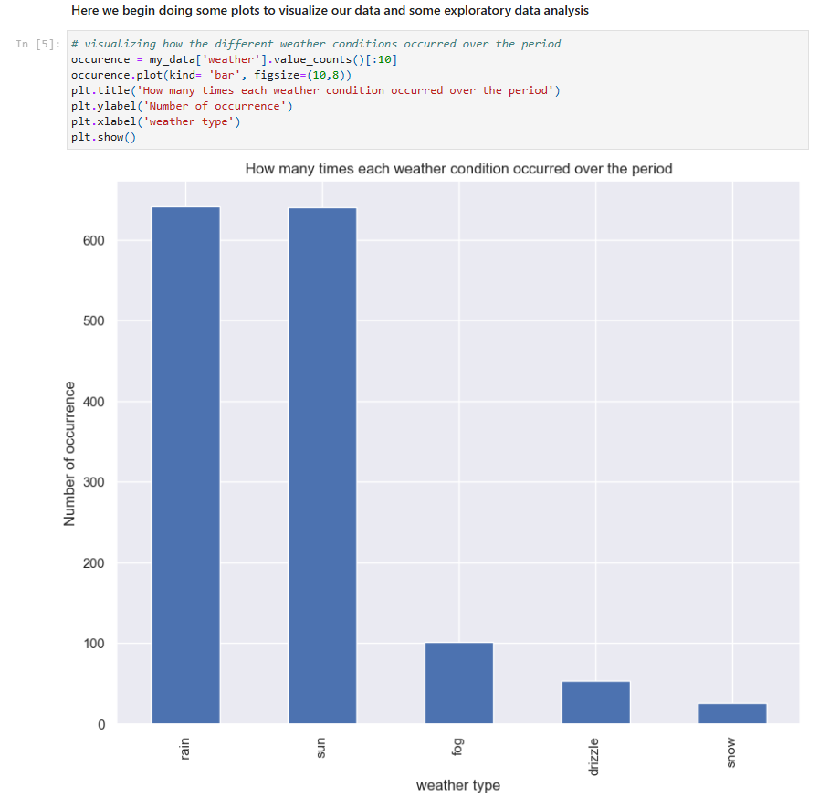
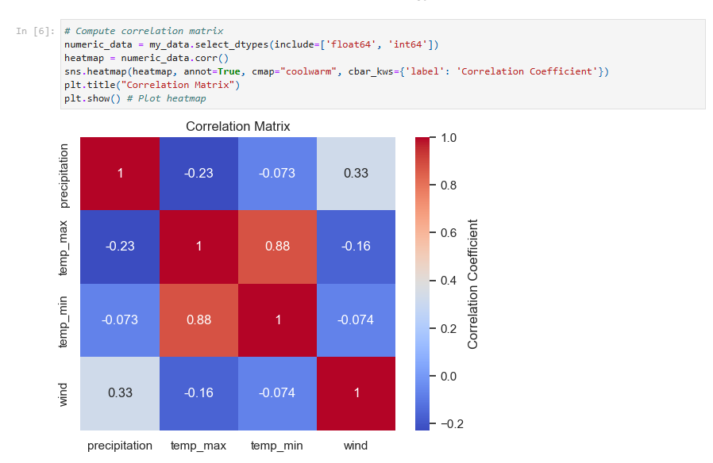
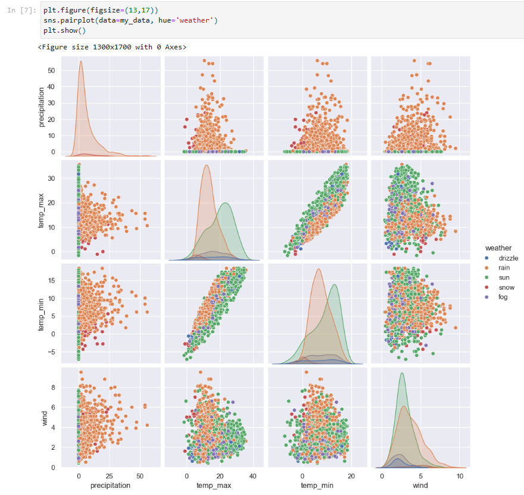
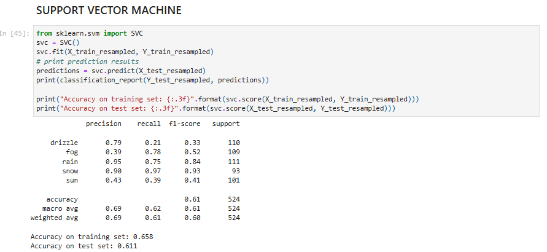
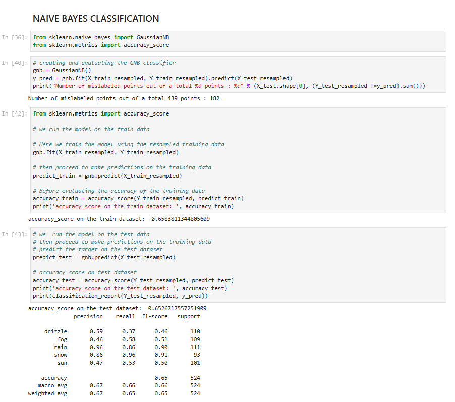
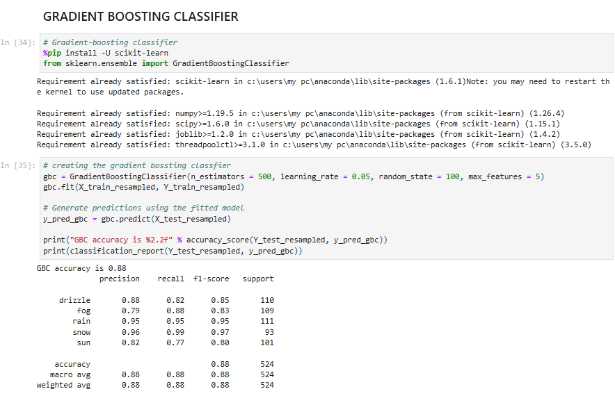
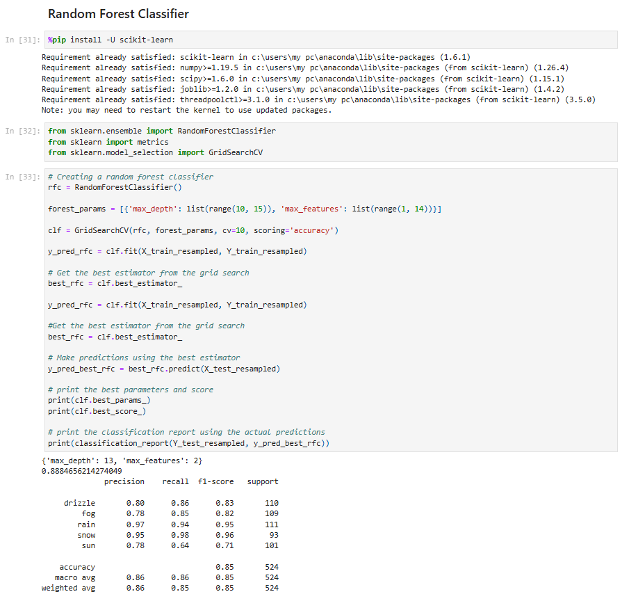

# ⛅ Weather Prediction using Machine Learning

This project applies machine learning classification models to predict weather outcomes based on various influencing features. It includes exploratory data analysis, data preprocessing, and model evaluation using Python.

---

## 📁 Project Structure

1. Data Import & Cleaning  
2. Exploratory Data Analysis (EDA)  
3. Feature Scaling & Normalization  
4. Model Training & Evaluation  

---

## 📊 Exploratory Data Analysis

Performed EDA to understand the distribution and relationships of features. Plots and visualizations were generated to gain insights before modeling.

---

## ⚙️ Data Preprocessing

- Handled missing values
- Normalized features to ensure fair comparison
- Split data into **training** and **test** sets

---

## 🤖 Machine Learning Models Applied

- Support Vector Machine (SVM)
- Naive Bayes Classification
- Logistic Regression
- Gradient Boosting Classifier (GBC)
- Random Forest Classifier

### 📈 Model Evaluation

Each model was evaluated using accuracy, precision, recall, and F1-score to determine performance.

---

## 🔍 Observations

- Feature scaling significantly impacted SVM and KNN performance
- Random Forest showed strong performance and generalization
- Visualization helped uncover hidden trends in weather attributes

---

## 🧪 Technologies Used

- **Language**: Python  
- **Libraries**: `pandas`, `matplotlib`, `seaborn`, `scikit-learn`

---

